# Présence sur Internet des ordres professionnels

## 1. Administrateurs agréés

https://www.adma.qc.ca 
:+1: Site web réalisé par [Coopérative Belvédère communication](http://coopbelvedere.com/fr/).

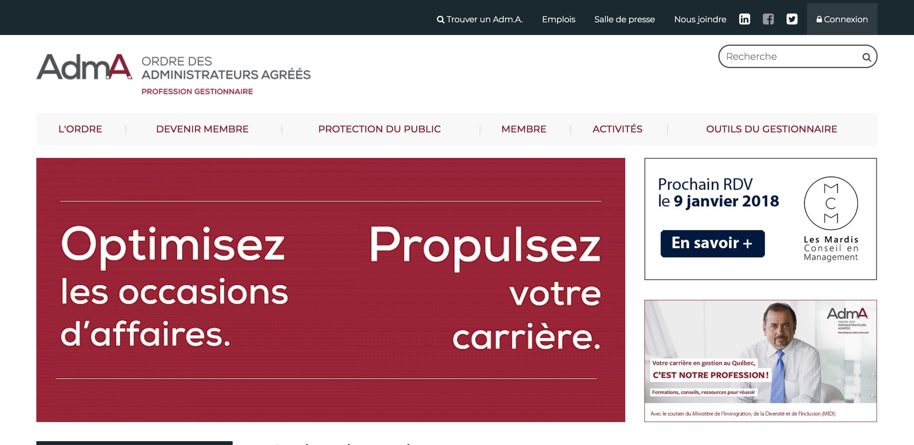

Facebook : https://www.facebook.com/OrdreAdmA, 833&nbsp;abonnés. 
LinkedIn : https://www.linkedin.com/company/1010422/, 1&nbsp;455&nbsp;abonnés. 
Twitter : https://twitter.com/OrdreAdmA, 618&nbsp;abonnés, 2&nbsp;125&nbsp;tweets. 
Pages consultées le 31&nbsp;décembre 2017.

## 2. Avocats (Barreau)

http://www.barreau.qc.ca/

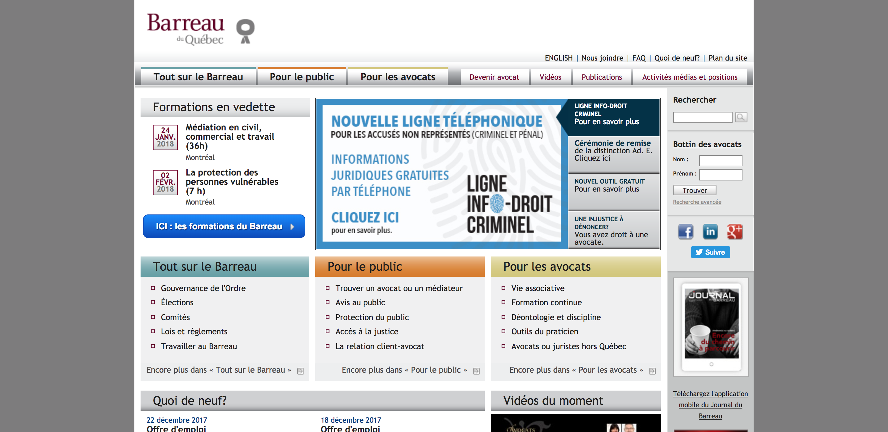

Facebook : https://www.facebook.com/barreauduquebec, 11&nbsp;111&nbsp;abonnés. 
LinkedIn : https://www.linkedin.com/groups/2206718/profile, 4&nbsp;290&nbsp;abonnés. 
Twitter : https://twitter.com/BarreauduQuebec, 7&nbsp;595&nbsp;abonnés, 2&nbsp;341&nbsp;tweets. 
Google+ : https://plus.google.com/+barreauduquebec, 185&nbsp;abonnés. 
Pages consultées le 31&nbsp;décembre 2017.

## 3. Dentistes

http://www.odq.qc.ca/

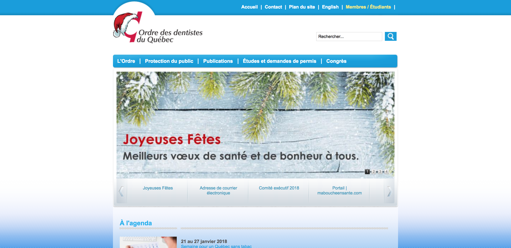

Facebook : https://www.facebook.com/Ma-bouche-en-sant%C3%A9-578007038954761/, 1&nbsp;415&nbsp;abonnés. 
LinkedIn : https://www.linkedin.com/company/ordre-des-dentistes-du-qu-bec/, 601&nbsp;abonnés. 
YouTube : https://www.youtube.com/channel/UCgUbTWh6K9zED7KkQJ501AA, 172&nbsp;abonnés. 
Twitter : https://twitter.com/ordredentistes, 826&nbsp;abonnés, 508&nbsp;tweets. 
Pages consultées le 31&nbsp;décembre 2017.

## 4. Denturologistes

https://www.odq.com

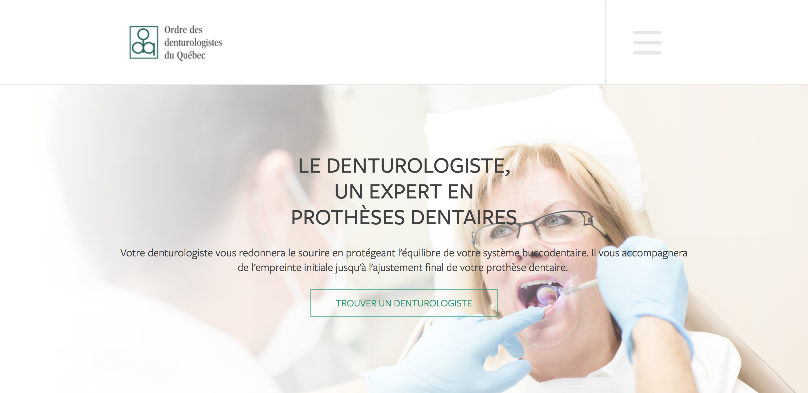

Facebook : https://www.facebook.com/ordredesdenturologistesduquebec, 2&nbsp;723&nbsp;abonnés. 
Twitter : https://twitter.com/ordredenturosqc?lang=fr, 93&nbsp;abonnés, 91&nbsp;tweets. 
Pages consultées le 31&nbsp;décembre 2017.

## 5. Acupuncteurs

http://www.o-a-q.org/

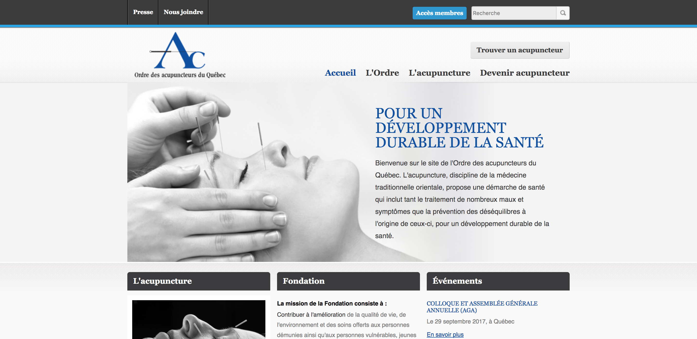

Page consultée le 31&nbsp;décembre 2017.

## 6. Agronomes

https://oaq.qc.ca/ 
:+1: Site web réalisé par [MXO Agence Totale](https://mxo.agency/).

Facebook : https://www.facebook.com/agronomesQc/?fref=ts, 1&nbsp;672&nbsp;abonnés. 
LinkedIn : https://www.linkedin.com/company/11116958/, 131&nbsp;abonnés. 
YouTube : https://www.youtube.com/channel/UCmOSldrzyuS03ipOIbtJJug, 21&nbsp;abonnés. 
Twitter : https://twitter.com/agronomesQc, 1&nbsp;185&nbsp;abonnés, 1&nbsp;528&nbsp;tweets. 
Pages consultées le 31&nbsp;décembre 2017.

## 7. Architectes

https://www.oaq.com/accueil.html

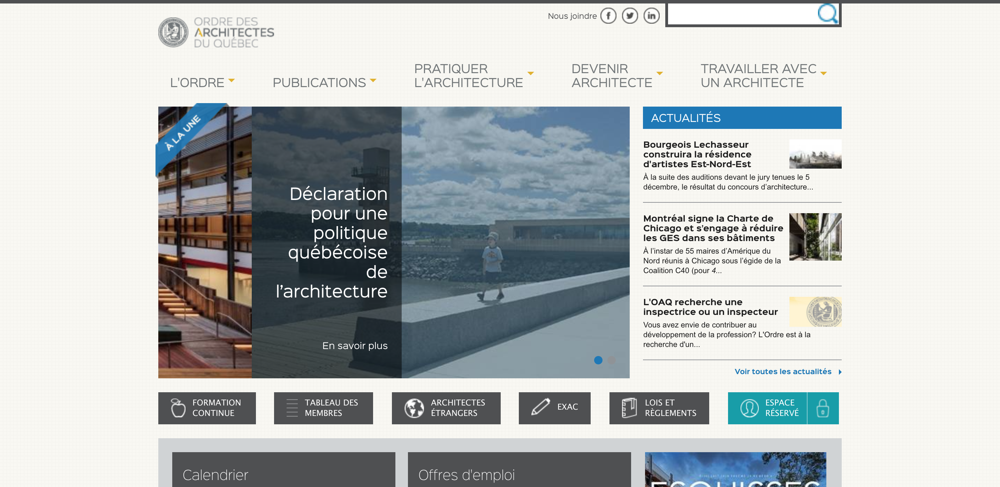

Facebook : https://www.facebook.com/Ordre.architectes.Qc/, 4&nbsp;390&nbsp;abonnés. 
LinkedIn : https://www.linkedin.com/company/3356519/, 1&nbsp;521&nbsp;abonnés. 
Twitter : https://twitter.com/OAQenbref, 1&nbsp;752&nbsp;abonnés, 2&nbsp;938&nbsp;tweets. 
Pages consultées le 31&nbsp;décembre 2017.

## 8. Arpenteurs-géomètres

www.oagq.qc.ca/

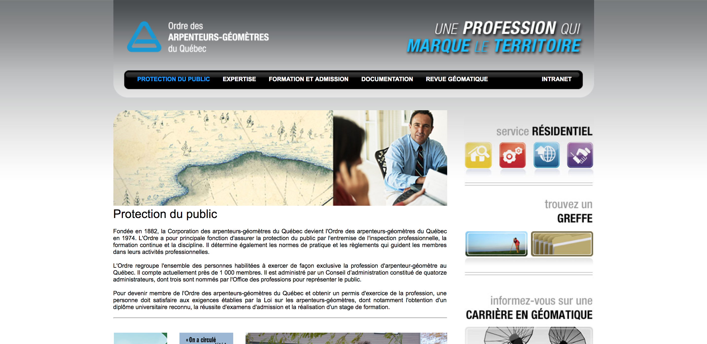

Page consultée le 31&nbsp;décembre 2017.

## 9. Audioprothésistes

www.ordreaudio.qc.ca/

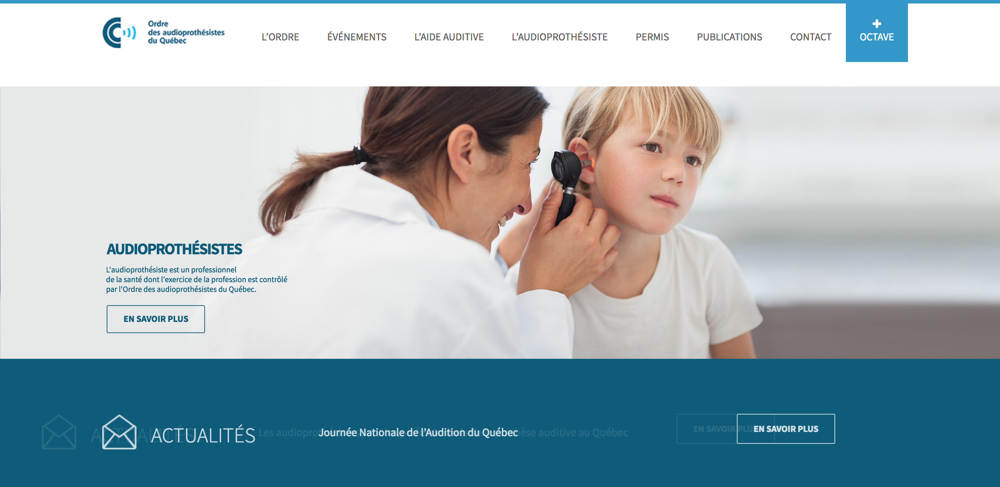

Page consultée le 31&nbsp;décembre 2017.

## 10. Chimistes

https://ocq.qc.ca/

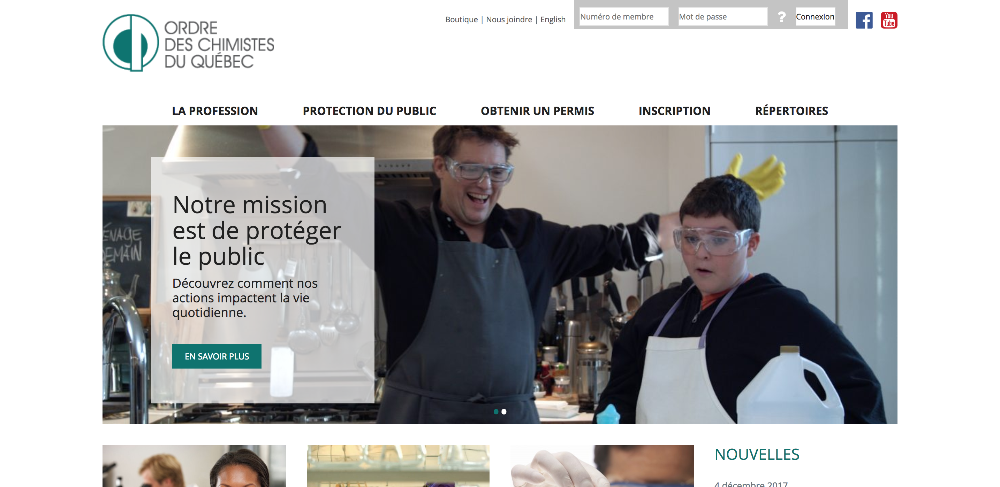

Facebook : https://www.facebook.com/Ordre-des-chimistes-du-Qu%C3%A9bec-1285160824849865/?fref=ts, 310&nbsp;abonnés. 
YouTube : https://www.youtube.com/channel/UCg80bGgM_9rC16kvGjrOW9w, 88&nbsp;abonnés. 
Pages consultées le 31&nbsp;décembre 2017.

## 11. Chiropraticiens

www.ordredeschiropraticiens.ca/

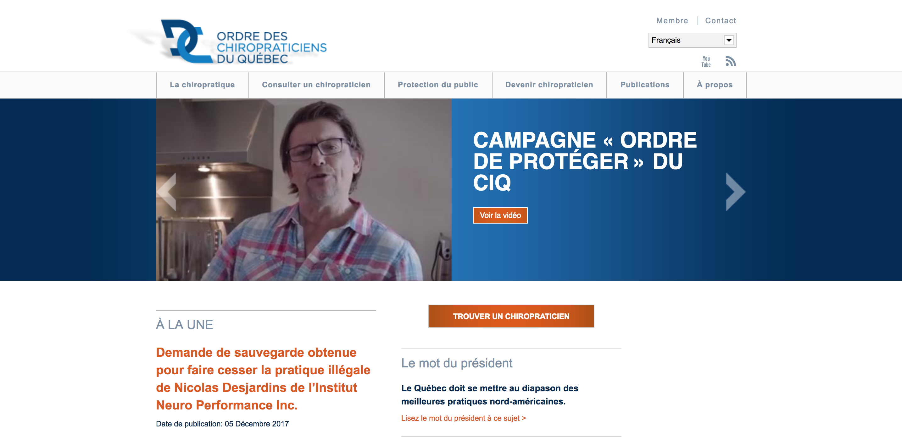

YouTube : https://www.youtube.com/user/Ordrechirosqc, 85&nbsp;abonnés. 
Fils RSS : http://www.ordredeschiropraticiens.ca/fr/rss.xml  
Pages consultées le 31&nbsp;décembre 2017.

## 12. Comptables professionnels agréés

cpaquebec.ca 
:+1: Site web réalisé par l'[Ordre des CPA du Québec](http://cpaquebec.ca/fr/realisation-du-site/).

Ordre des CPA du Québec

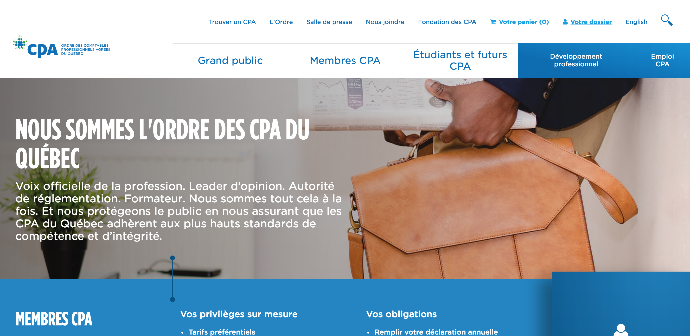

Facebook CPA : https://www.facebook.com/CPAquebec, 11&nbsp;908&nbsp;abonnés. 
Facebook - Devenir CPA : https://www.facebook.com/devenircpa/, 11&nbsp;401&nbsp;abonnés. 
LinkedIn : https://www.linkedin.com/groups/3996221/profile, 8&nbsp;892&nbsp;abonnés. 
YouTube : https://www.youtube.com/user/CPAquebec, 612&nbsp;abonnés. 
Instagram : https://www.instagram.com/cpaquebec/, 817&nbsp;abonnés. 
Twitter : https://twitter.com/CPAquebec, 2&nbsp;519&nbsp;abonnés, 3&nbsp;011&nbsp;tweets. 
Google+ : https://plus.google.com/108732341843771497243, 27&nbsp;abonnés. 
Flickr : https://www.flickr.com/photos/145984004@N06/, 17&nbsp;abonnés. 
Pages consultées le 31&nbsp;décembre 2017.

## 13. Conseillers en ressources humaines agréés

http://www.portailrh.org

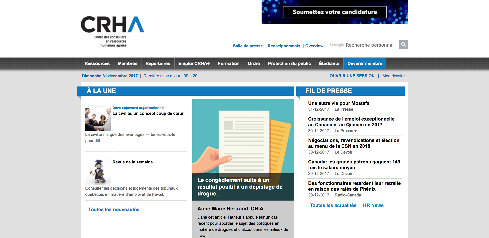

Facebook : https://www.facebook.com/OrdreCRHACRIA/, 16&nbsp;022&nbsp;abonnés. 
LinkedIn : https://www.linkedin.com/groups/3233907/profile, 20&nbsp;509&nbsp;abonnés. 
YouTube : https://www.youtube.com/user/OrdreCRHACRIA, 543&nbsp;abonnés. 
Instagram : https://www.instagram.com/crhacria/, 650&nbsp;abonnés. 
Twitter : https://twitter.com/crha_quebec, 4&nbsp;285&nbsp;abonnés, 6&nbsp;668&nbsp;tweets. 
Google+ : https://plus.google.com/108511770868349737031, 209&nbsp;abonnés. 
Fils RSS : http://www.portailrh.org/rss/  
Pages consultées le 31&nbsp;décembre 2017.

## 14. Conseillers et conseillères d’orientation

www.orientation.qc.ca/

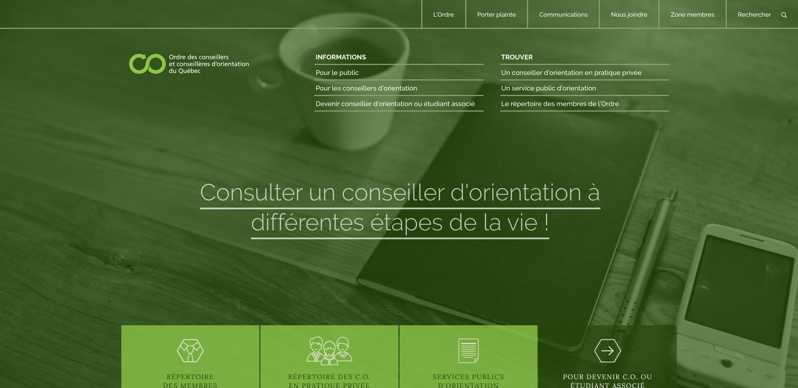

Page consultée le 31&nbsp;décembre 2017.

## 15. Criminologues

ordrecrim.ca/

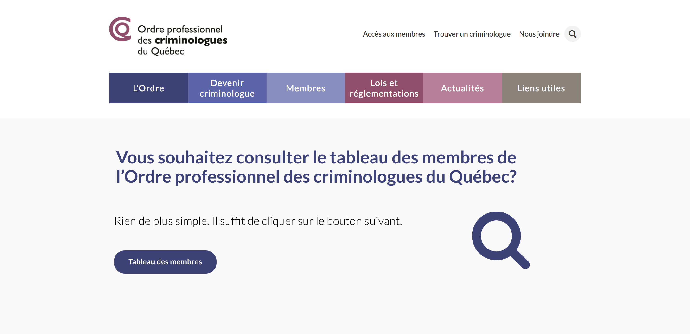

Facebook : https://www.facebook.com/criminologues, 2&nbsp;362&nbsp;abonnés. 
Pages consultées le 31&nbsp;décembre 2017.

## 16. Diététistes

https://opdq.org/

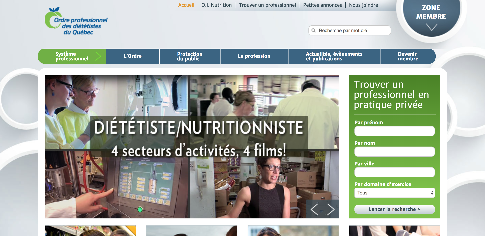

Page consultée le 31&nbsp;décembre 2017.

## 17. Ergothérapeutes

https://www.oeq.org/

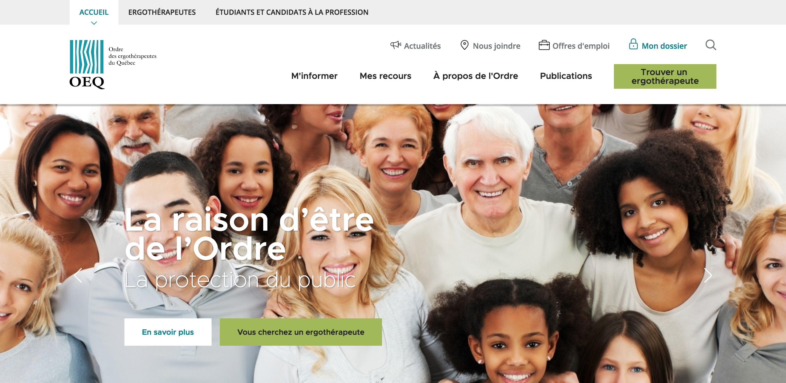

Portail aux membres : https://portail.oeq.org/. 
Pages consultées le 31&nbsp;décembre 2017.

## 18. Évaluateurs agréés

https://oeaq.qc.ca/

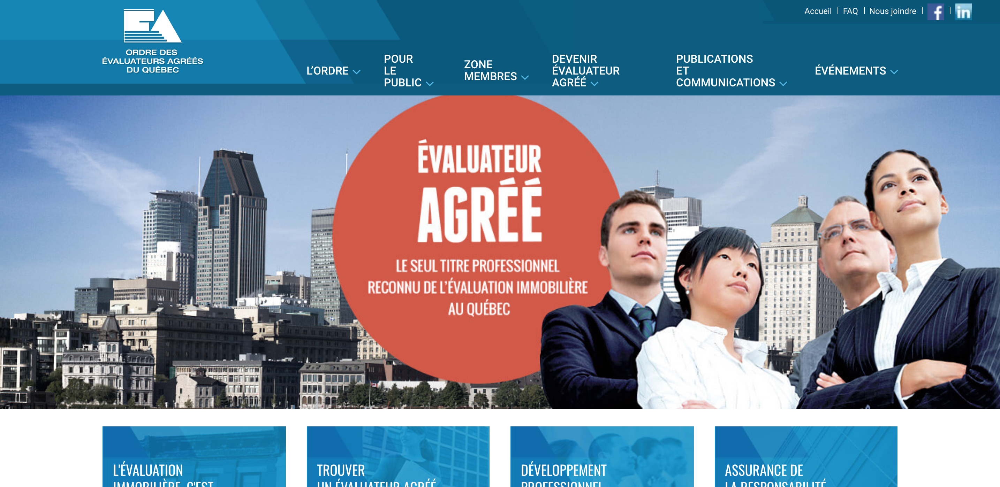

Portail aux membres : https://oeaq.qc.ca/zone-membres/. 
Facebook : https://www.facebook.com/oeaq.qc.ca/?fref=ts, 732&nbsp;abonnés. 
LinkedIn : https://www.linkedin.com/company/10978954/, 191&nbsp;abonnés. 
Pages consultées le 31&nbsp;décembre 2017.

## 19. Géologues

www.ogq.qc.ca/

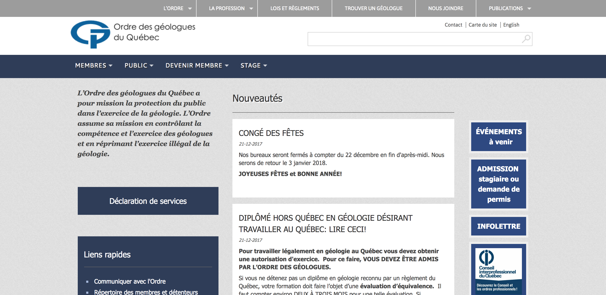

Page consultée le 31&nbsp;décembre 2017.

## 20. Huissiers de justice

www.chjq.ca/

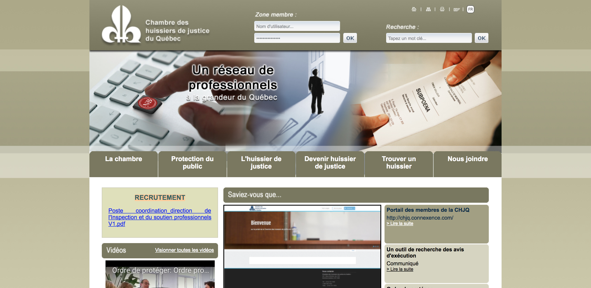

Page consultée le 31&nbsp;décembre 2017.

## 21. Hygiénistes dentaires

https://www.ohdq.com/

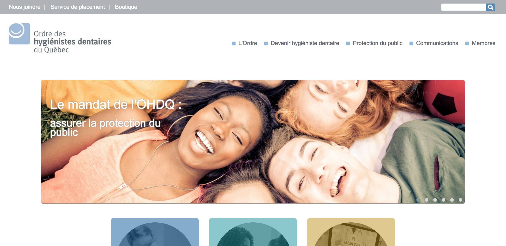

Page consultée le 31&nbsp;décembre 2017.

## 22. Infirmières et infirmiers

www.oiiq.org/

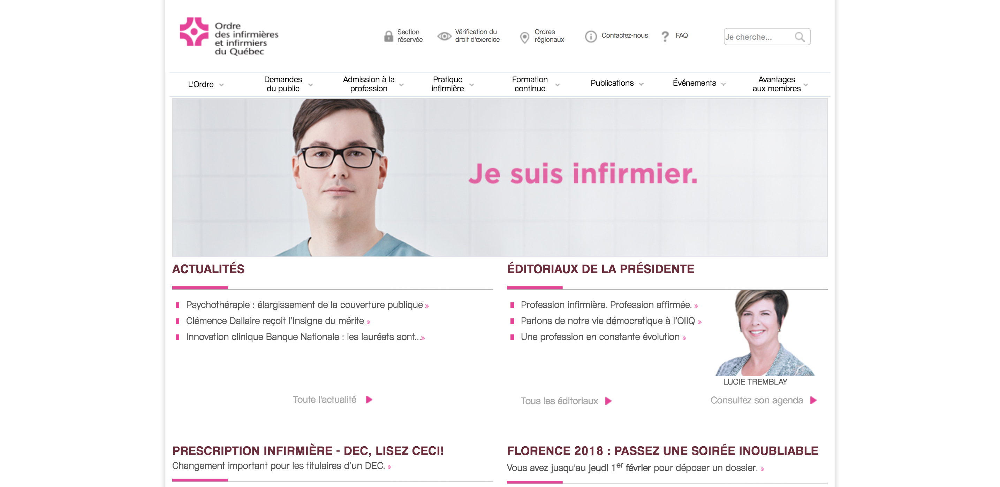

Facebook : https://www.facebook.com/OIIQSante, 43&nbsp;412&nbsp;abonnés. 
Twitter : https://twitter.com/OIIQ, 4&nbsp;437&nbsp;abonnés, 2&nbsp;180&nbsp;tweets. 
Flickr : https://www.flickr.com/photos/ordreinf/sets/, 6&nbsp;abonnés. 
Vimeo : https://vimeo.com/oiiq, 63&nbsp;abonnés. 
Fils RSS : https://www.oiiq.org/salle-de-presse/fils-rss. 
Pages consultées le 31&nbsp;décembre 2017.

## 23. Infirmières et infirmiers auxiliaires

http://www.oiiaq.org/

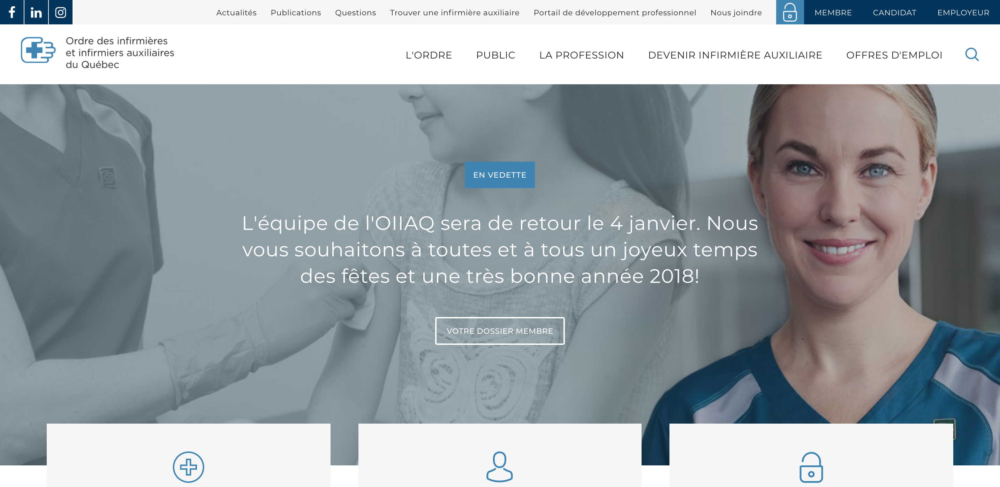

Facebook : https://www.facebook.com/oiiaq.org, 10&nbsp;872&nbsp;abonnés. 
LinkedIn : https://www.linkedin.com/company/11171966/, 75&nbsp;abonnés. 
Instagram : https://www.instagram.com/oiiaquebec/, 119&nbsp;abonnés. 
Pages consultées le 31&nbsp;décembre 2017.

## 24. Ingénieurs

http://oiq.qc.ca/

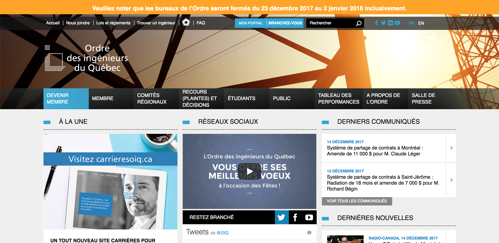

Facebook : https://www.facebook.com/oiq.qc.ca/, 12&nbsp;301&nbsp;abonnés. 
LinkedIn : https://www.linkedin.com/company/604039, 5&nbsp;181&nbsp;abonnés. 
YouTube : https://www.youtube.com/user/ordredesingenieurs/videos, 259&nbsp;abonnés. 
Twitter : https://twitter.com/OIQ, 3&nbsp;835&nbsp;abonnés, 2&nbsp;331&nbsp;tweets. 
Pages consultées le 31&nbsp;décembre 2017.

## 25. Ingénieurs forestiers

http://www.oifq.com/

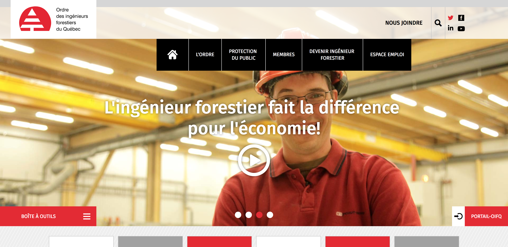

Facebook : https://www.facebook.com/OIFQc/, 1&nbsp;382&nbsp;abonnés. 
LinkedIn : https://www.linkedin.com/company/8337438/, 113&nbsp;abonnés. 
YouTube : https://www.youtube.com/channel/UCcRVeY0qZJrWcRQ2wuSKhRw, 65&nbsp;abonnés. 
Twitter : https://twitter.com/oifqc, 449&nbsp;abonnés, 405&nbsp;tweets. 
Pages consultées le 31&nbsp;décembre 2017.

## 26. Inhalothérapeutes

www.opiq.qc.ca/

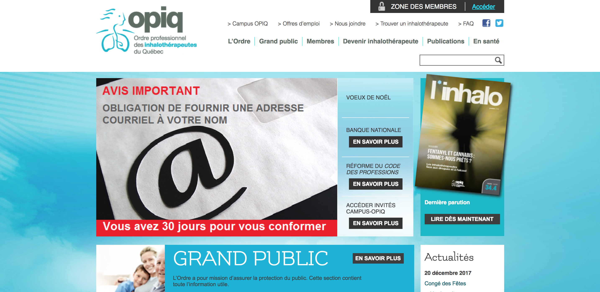

Facebook : https://www.facebook.com/opiq.qc.ca/, 1&nbsp;959&nbsp;abonnés. 
Twitter : https://twitter.com/OPIQinh, 180&nbsp;abonnés, 834&nbsp;tweets. 
Pages consultées le 31&nbsp;décembre 2017.

## 27. Médecins (Collège des médecins)

www.cmq.org

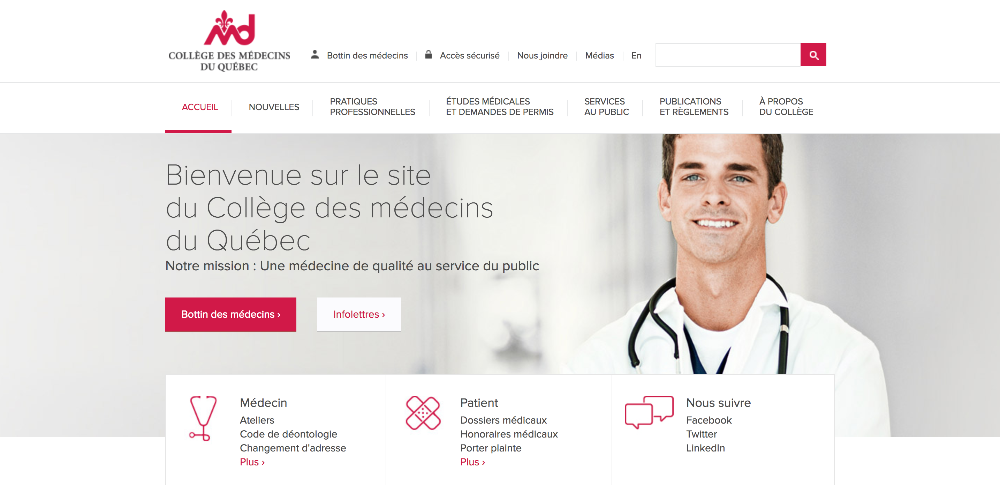

Facebook : https://www.facebook.com/Coll%C3%A8ge-des-m%C3%A9decins-du-Qu%C3%A9bec-257741694238490/, 3&nbsp;075&nbsp;abonnés. 
LinkedIn : https://www.linkedin.com/company/11257185/, 187&nbsp;abonnés. 
Twitter : https://twitter.com/CMQ_org, 5&nbsp;020&nbsp;abonnés, 282&nbsp;tweets. 
Pages consultées le 31&nbsp;décembre 2017.

## 28. Notaires (Chambre des notaires du Québec)

www.cnq.org/

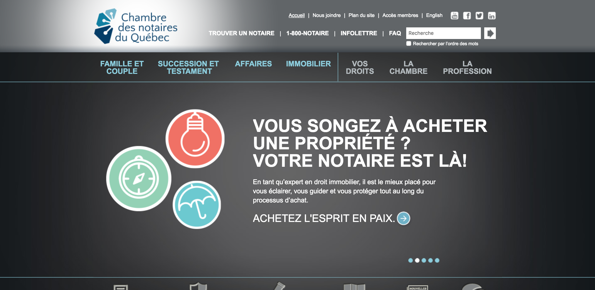

Facebook : https://www.facebook.com/ChambredesnotairesduQuebec, 7&nbsp;289&nbsp;abonnés. 
LinkedIn : https://www.linkedin.com/company/10415433/, 565&nbsp;abonnés. 
YouTube : https://www.youtube.com/user/ChambreDesNotaires, 261&nbsp;abonnés. 
Twitter : https://twitter.com/NotairesQc, 376&nbsp;abonnés, 189&nbsp;tweets. 
Pages consultées le 31&nbsp;décembre 2017.

## 29. Opticiens d'ordonnances

http://www.opticien.qc.ca/

Page consultée le 31&nbsp;décembre 2017.

## 30. Optométristes

https://www.ooq.org/

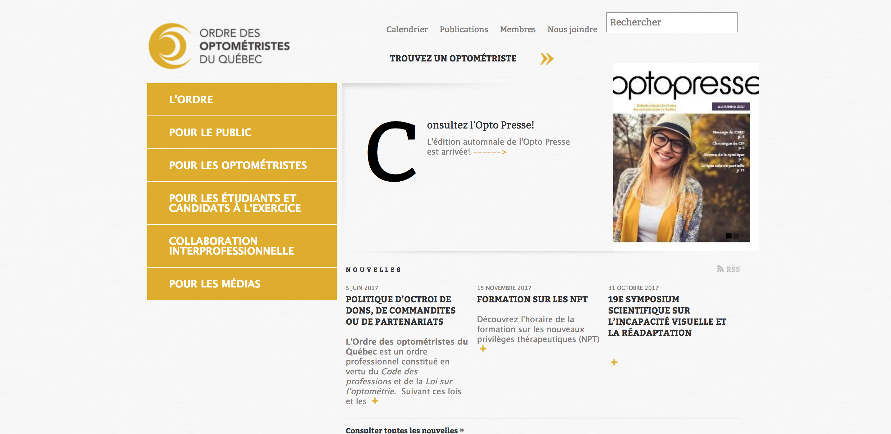

Page consultée le 31&nbsp;décembre 2017.

## 31. Orthophonistes et audiologistes

www.ooaq.qc.ca/

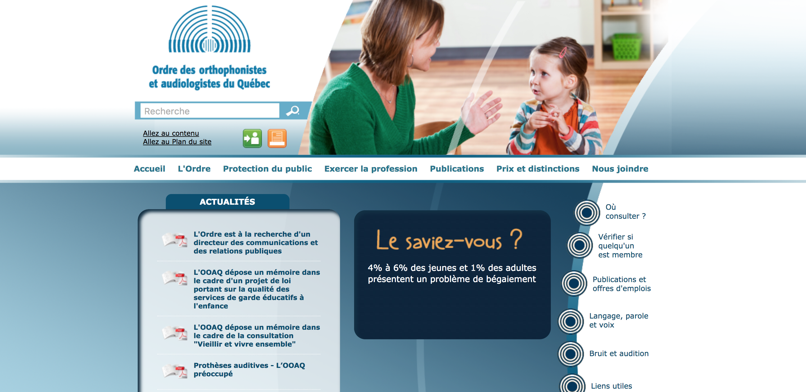

Facebook : https://www.facebook.com/Ordre-des-orthophonistes-et-audiologistes-du-Qu%C3%A9bec-OOAQ-286966305093140/?fref=ts, 1&nbsp;252&nbsp;abonnés. 
LinkedIn : https://www.linkedin.com/company/ooaq/, 80&nbsp;abonnés. 
YouTube : https://www.youtube.com/channel/UCOMl_RSl03Dzg5zTRX1izcA, 0&nbsp;abonné. 
Pages consultées le 31&nbsp;décembre 2017.

## 32. Pharmaciens

https://www.opq.org/

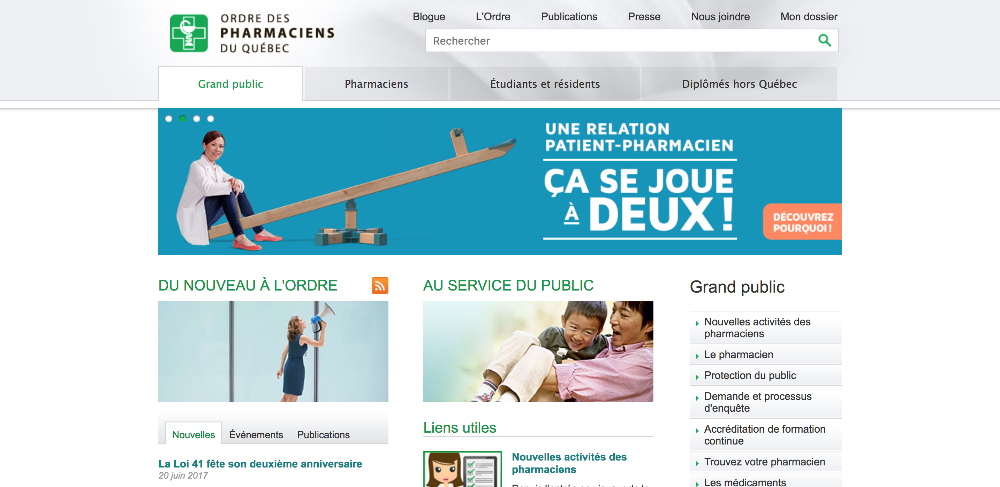

Facebook : https://www.facebook.com/OrdredespharmaciensduQuebec, 7&nbsp;719&nbsp;abonnés. 
YouTube : https://www.youtube.com/user/ordrepharmaciensqc, 387&nbsp;abonnés. 
Twitter : https://twitter.com/ordrepharmaQc, 3&nbsp;450&nbsp;abonnés, 883&nbsp;tweets. 
Pages consultées le 31&nbsp;décembre 2017.

## 33. Physiothérapie (Ordre professionnel de la physiothérapie du Québec)

https://oppq.qc.ca/

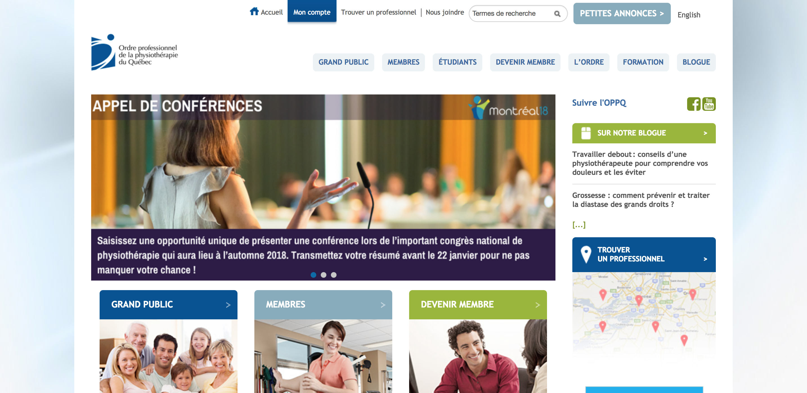

Facebook : https://www.facebook.com/ordre.physiotherapie.quebec, 5&nbsp;687&nbsp;abonnés. 
YouTube : https://www.youtube.com/channel/UChbfstW150slWxQI88Evj6A, 265&nbsp;abonnés. 
Pages consultées le 31&nbsp;décembre 2017.

## 34. Podiatres

http://www.ordredespodiatres.qc.ca/

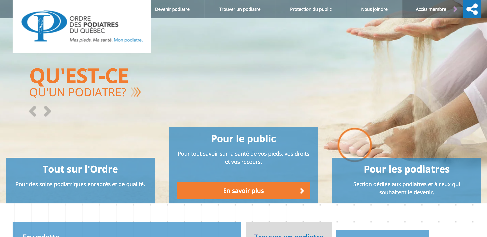

Page consultée le 31&nbsp;décembre 2017.

## 35. Psychoéducateurs et psychoéducatrices

www.ordrepsed.qc.ca/

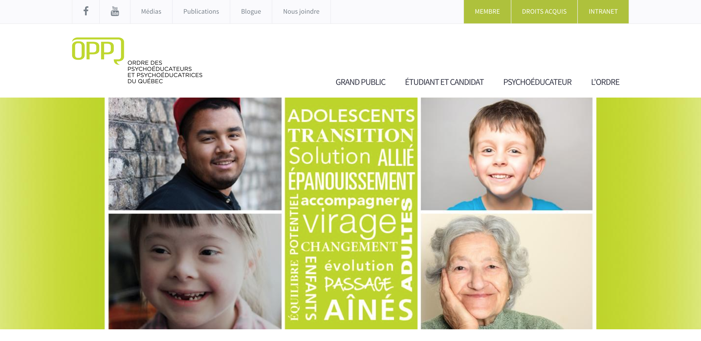

Facebook : https://www.facebook.com/ordrepsed/?ref=br_tf, 7&nbsp;186&nbsp;abonnés. 
YouTube : https://www.youtube.com/user/ordrepsychoeducateur, 73&nbsp;abonnés. 
Pages consultées le 31&nbsp;décembre 2017.

## 36. Psychologues

https://www.ordrepsy.qc.ca/

Twitter : https://twitter.com/ordrepsy, 2&nbsp;011&nbsp;abonnés, 1&nbsp;278&nbsp;tweets. 
Pages consultées le 31&nbsp;décembre 2017.

## 37. Sages-femmes

www.osfq.org/

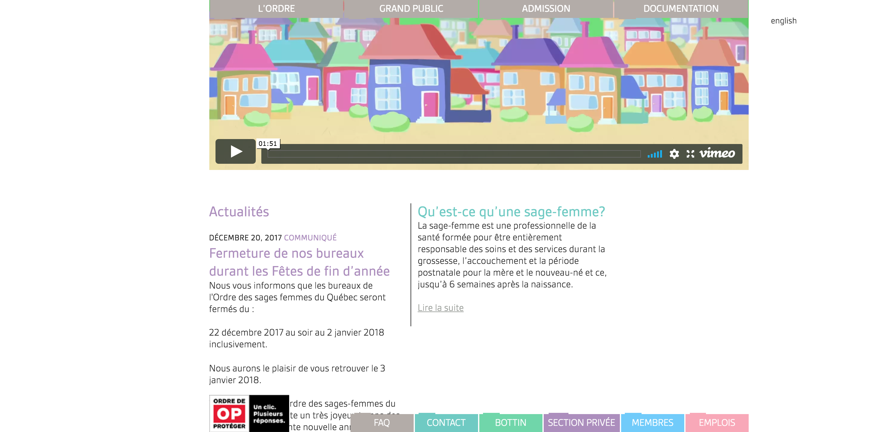

Page consultée le 31&nbsp;décembre 2017.

## 38. Sexologues (Ordre professionnel des sexologues du Québec)

https://opsq.org/

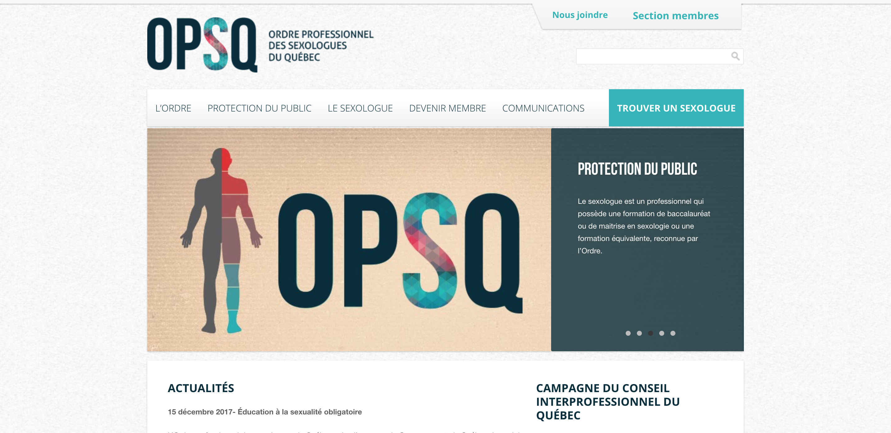

Page consultée le 31&nbsp;décembre 2017.

## 39. Techniciens et techniciennes dentaires

www.ottdq.com/

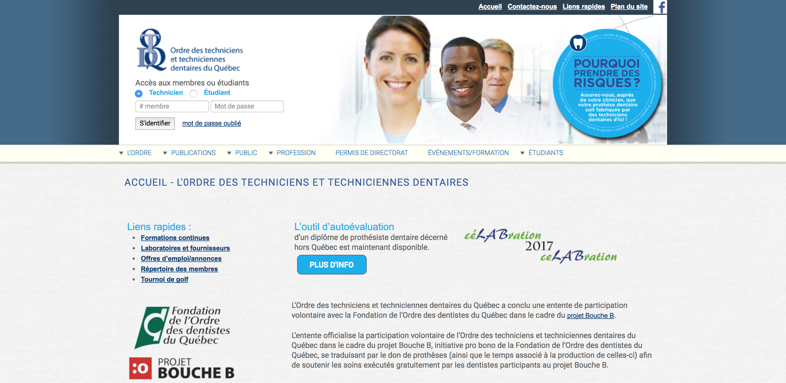

Facebook : https://www.facebook.com/OTTDQ, 443&nbsp;abonnés. 
Pages consultées le 31&nbsp;décembre 2017.

## 40. Technologistes médicaux

www.optmq.org/

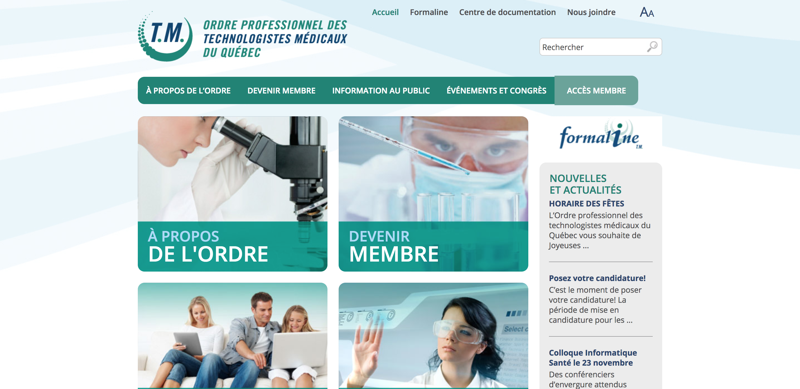

Portail aux membres: https://formaline.optmq.org/. 
Pages consultées le 31&nbsp;décembre 2017.

## 41. Technologues en imagerie médicale, en radio-oncologie et en électrophysiologie médicale

www.otimroepmq.ca/

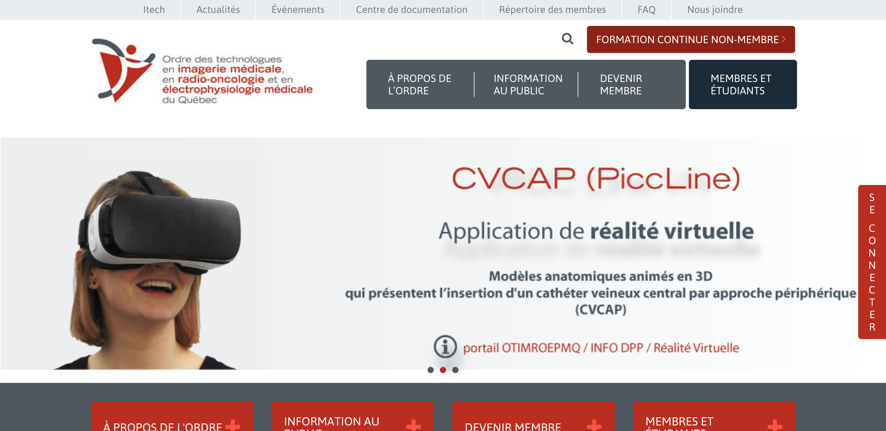

Facebook : https://www.facebook.com/OTIMROEPMQ/, 1&nbsp;393&nbsp;abonnés. 
Pages consultées le 31&nbsp;décembre 2017.

## 42. Technologues professionnels

www.otpq.qc.ca/ 

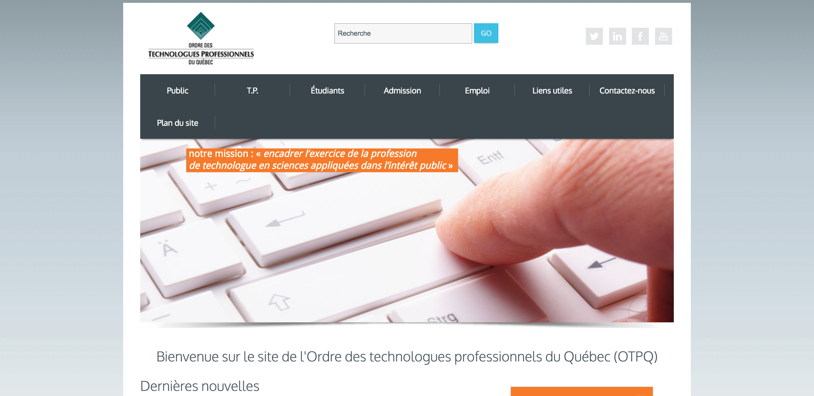

Facebook : https://www.facebook.com/TechnologuesProfessionnels, 1&nbsp;789&nbsp;abonnés. 
LinkedIn : https://www.linkedin.com/groups/4134994/profile, 1&nbsp;256&nbsp;abonnés. 
YouTube : https://www.youtube.com/user/TechnologuePro1, 25&nbsp;abonnés. 
Twitter : https://twitter.com/otpq, 2&nbsp;264&nbsp;abonnés, 4&nbsp;072&nbsp;tweets. 
Pages consultées le 31&nbsp;décembre 2017.

## 43. Traducteurs, terminologues et interprètes agréés

https://ottiaq.org/ 

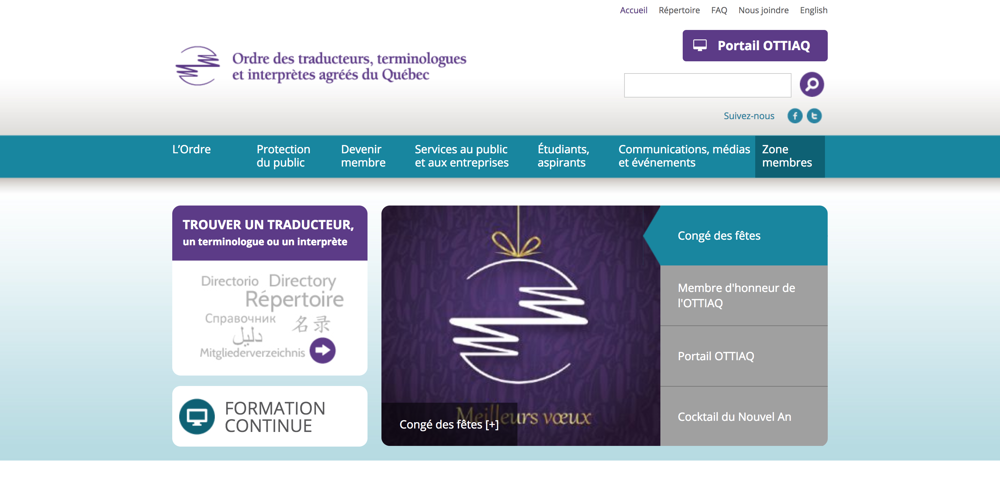

Facebook : abonnés.
LinkedIn :
YouTube : abonnés.
Instagram : abonnés.
Twitter : abonnés,  tweets.
Google+ : abonnés.
Flickr : abonnés.
Pages consultées le 31&nbsp;décembre 2017.

## 44. Travailleurs sociaux et thérapeutes conjugaux et familiaux

https://otstcfq.org/ 

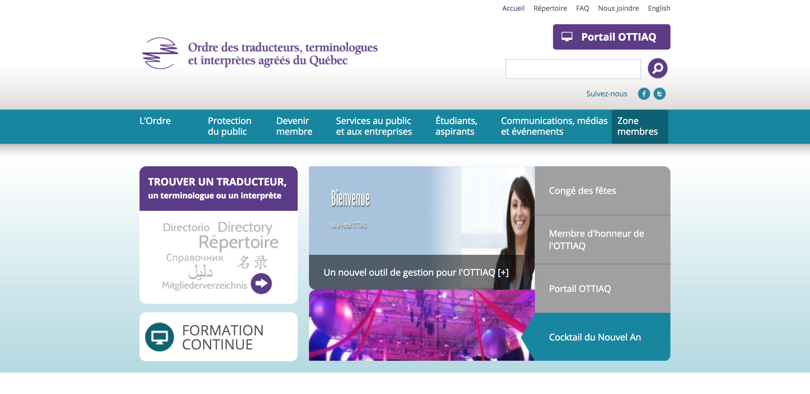

Portail aux membres: https://portail.ottiaq.org/ (Connexence) 
Facebook : https://www.facebook.com/Congr%C3%A8s-de-lOTTIAQ-180461225331419/, 700&nbsp;abonnés. 
Twitter : https://twitter.com/ottiaq, 1&nbsp;363&nbsp;abonnés, 462&nbsp;tweets. 
Pages consultées le 31&nbsp;décembre 2017.

## 45. Urbanistes

http://www.ouq.qc.ca/ 

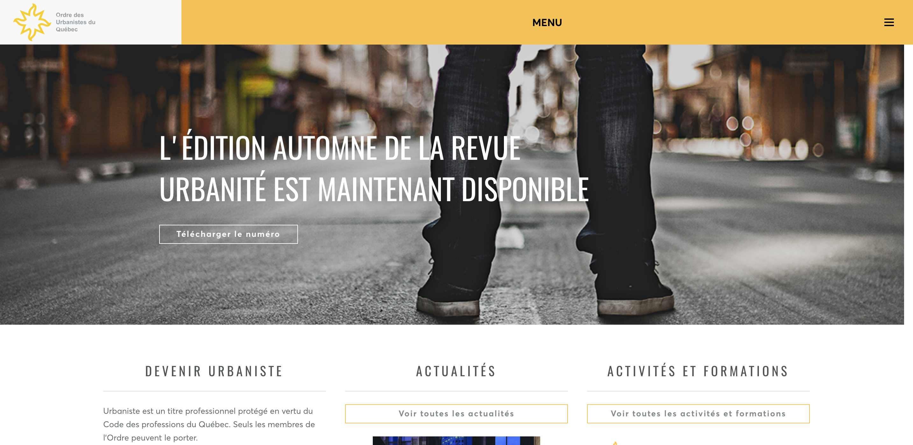

Page consultée le 31&nbsp;décembre 2017.

## 46. Vétérinaires (médecins vétérinaires)

https://www.omvq.qc.ca

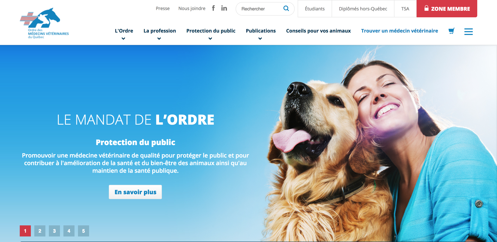

Page consultée le 31&nbsp;décembre 2017.